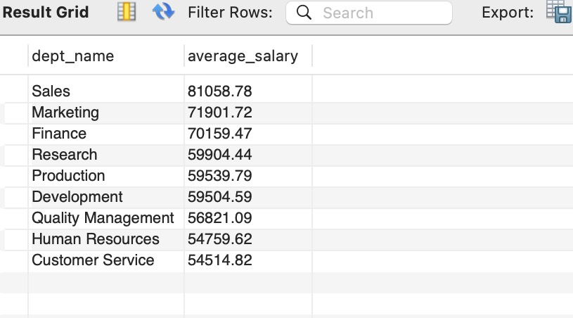

# Turnover Rate

[Employee Turnover Dashboard on Tableau Public](https://public.tableau.com/app/profile/yaa.yeboah/viz/EmployeeTurnoverDashboard_17028715143540/EmployeeTurnoverDashbord?publish=yes)


Turnover rate is a metric that measures the rate at which employees leave a company and are replaced by new hires.

The formula for turnover rate is:

$$ Turnover\ rate = {Number\ of\ Employess\ who\ left \over Average\ number\ of\ employee} *100\% $$

The Number of employees who left also known as the number of separations was calculated using the information from the *table dept_emp* which includes the employee to date which is an employee’s last day of employment.

By finding the number of employees whose last day of employment was within the last year,we find the number of separations.

The average number of employees is calculated using the following formula:

$$ {Number\ of\ Employess\ at\ the\ beginning\ of\ the\ year \over 2}$$

The Number of employees at the beginning of the year=

```
Number of employees at the end of previous year +
Number of people hired on January 1st of the current year -
Number of employees who left on January 1st of the current year
```
The Number of employees at the beginning of the year=
```
Number of employees as of January 1st of current year+
Number of people hired from January 2nd to December 31st of current year -
Number of employees who left from January 2nd to December 31st of the current year
```

**The Number of Active Employees** : The total number of people currently employed. This includes new hires and employees hired from prior years.

**The Number of Separations**: The number of people who leave the Company within the focus period

**Turnover per Quarter**: This includes the number of separations in each of the four quarters as well as their individual turnover rates. Quarter one (Q1) is defined as the period between January and March, Q2 is April-June , Q3 is July-September and Q4 is October-December

**Turnover Buckets**:
This chart shows how long an employee stays before separating from the company. It was created using the dept_emp table and calculating the monthly difference between an employee’s end date(to_date) and start date (from_date)

**Turnover per Department**:
This includes the number of separations in each of the nine departments as well as their individual turnover rates.This was found by joining the departments table and the dept_emp table and determining the end date for each employee in each department.

**Turnover Per Title**:
This includes the number of separations for each of the seven titles as well as their individual turnover rates.

**Turnover Type**
There are two types of turnover illustrated: Involuntary Turnover and Voluntary Turnover. Voluntary Turnover is defined as the termination of employees from an organization with there voluntary consent.The employee initiates the separation.
Involuntary turnover is defined as the termination of employees from an organization without their voluntary consent.The employer initiates the separation

# Recommendations
The data shows that the turnover rate for the company of focus is 0.7% which is very good and well below the industry benchmark of 10%. However, the number of employees who left the company increased by an astonishing 113% from the previous year. Therefore, it is pertinent to discuss why that might be as well as employee retention strategies for the company of focus.

Analysing Turnover in terms of:

1. **Demographics** - The data shows that in the past year, more men were hired compared to women across all departments and titles. This could indicate an unconscious recruitment bias that favors Males over Females. Leaders of the company should consider reviewing the recruitment process to ensure fairness and equal opportunities for all candidates as well as implement mentorship programs and training opportunities to support the professional growth of all employees with a focus on females. Moreover, men also saw the highest number of separations within the company and this could be due to issues with job satisfaction, work-life balance, or other factors affecting the overall work environment. To curb this, the company leaders will need to conduct exit interviews or surveys to understand the reasons behind the higher attrition among men.
2. **Quarter** - Quarters one, three, and four saw the highest attrition rates with quarter four having the highest number of separations. There are many reasons why quarter-four shows these results. They include:
   - Budget Constraints:

    Many companies operate on a fiscal year that ends in December. In the fourth quarter, organizations may be finalizing budget allocations for the next year. If budgets are tight, there may be decisions to reduce headcount, leading to layoffs or voluntary separations.
   - Performance Reviews and Bonuses:

    Performance reviews and bonus distributions often occur at the end of the calendar or fiscal year. Employees dissatisfied with their performance assessments or bonus amounts may decide to leave the company.
   - Job Market Dynamics:

    Employees might be more motivated to explore new job opportunities towards the end of the year, especially if they believe they can secure better offers or if they are seeking a change before the start of a new year.
   - Seasonal Work or Projects:

    Some industries experience increased activity or seasonal demand in the fourth quarter, leading to the hiring of temporary or contract workers. When these projects conclude, temporary employees may separate from the company.
   - Personal Reasons:

   Employees may decide to leave an organization for personal reasons such as relocating, starting a family, or pursuing further education. These personal decisions may not necessarily align with the organization's internal processes but could contribute to higher separations.


3. **Department**
The data shows that the customer service department has the highest turnover rate. Given the data shown below, we see that the customer service department has the lowest average salary compared to any other department. This could explain the high turnover rate. My recommendation is that the company reviews the salary structure for the customer service department to ensure that it is competitive within the industry and local market and considers offering performance-based incentives, bonuses, or other benefits to make the compensation package more attractive.

Another department to highlight would be the Development department. Although it’s turnover rate is comparable to the other departments’ rates, it shows that that department has the highest number of employee separations. This could be a result of many factors. To address this, I suggest conducting exit interviews with employees from that department to assess the high separation numbers.

4. **Title**:
The data shows that employees that occupy the staff roles have the highest turnover rates as well as separations.This may be due to limited Career Advancement Opportunities or Low Job Satisfaction with employees being dissatisfied with their roles or feeling unfulfilled or unchallenged. To address these concerns, I would suggest developing transparent career paths that outline potential advancements and promotions within the organization for employees in the staff title as well as training and development initiatives for staff members. The company should also consider recognition programs as well as social events and team building activities for its staff members.
5. **Reason**
The data shows that retirement is the top turnover reason. This aligns with the average employee age of 62 years. Employee retention strategies around retirement rates and workforce age include:
- Identifying key roles and developing a succession plan to ensure a smooth transition when employees retire.
- Providing training and development opportunities and mentorship programs for employees identified as successors.
- Creating a culture that supports work-life balance example part-time schedules or reduced hours making the workplace more attractive to those considering retirement.
